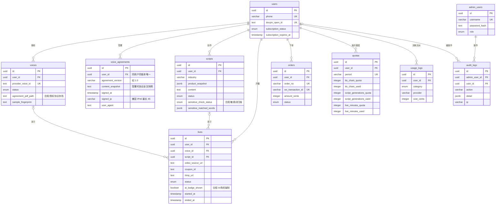

# 数据库设计（S0 定稿）

> 与 `server/src/db/schema.ts` 一一对应，由该文件生成（Drizzle ORM）。
> 变更规则：改 schema.ts → `npm run db:generate` 生成迁移 → 提交迁移文件，禁止直接改线上表。

## ER 关系图

## 表清单与职责

| 表 | 职责 | 关键约束 |
|---|---|---|
| users | 手机号/抖音OAuth/订阅状态 | phone 唯一、douyin_open_id 唯一 |
| voices | 音色与授权存档 | provider_voice_id 唯一；授权协议路径+签署时间+样本指纹（合规） |
| voice_agreements | 《声音授权协议》签署存档 | (user_id, agreement_version) 唯一；幂等签署（合规） |
| scripts | 话术与敏感词扫描 | product_snapshot 固化商品信息；blocked 状态阻断开播（合规） |
| lives | 直播记录 | ai_badge_shown 默认 true 不可关闭（合规）；关联音色+话术+券 |
| orders | 订单 | 金额单位分；order_no 与 wx_transaction_id 唯一 |
| quotas | 月度额度 | (user_id, period) 唯一；每月新起一行 |
| usage_logs | AI 调用流水 | 每次调用一条，含成本（分），后台成本页数据源 |
| admin_users | 后台管理员 | 密码只存哈希；role: super_admin/operator |
| audit_logs | 审计日志 | 封禁/放行/退款等操作全留痕，IP 最长 45 兼容 IPv6 |

## 枚举定义

| 枚举 | 值 |
|---|---|
| subscription_status | free / paid |
| voice_status | pending / processing / ready / failed |
| script_status | draft / ready / blocked |
| sensitive_check_status | pass / blocked |
| live_status | idle / ready / live / ended / failed |
| order_status | pending / paid / refunded / closed |
| usage_category | voice_clone / tts / script_generation / sensitive_check |
| admin_role | super_admin / operator |

## 合规字段专项说明（审计重点）

1. `voices.agreement_pdf_path` + `agreement_signed_at`：无授权记录的音色不得用于直播
2. `scripts.sensitive_check_status = blocked`：开播前置校验必查此字段
3. `lives.ai_badge_shown`：恒为 true，任何代码路径不得置 false
4. `audit_logs`：后台对商家的一切处置（封禁/退款/放行）必须落此表
5. `voice_agreements`：录音/克隆前必须签署并存档（谁、何时、哪一版协议、IP、User-Agent、全文快照）。
   MVP 存档口径 = 数据库记录（版本号 + 全文快照 + 时间 + IP + UA），**不生成 PDF**；
   PDF 渲染导出推迟到 T19 后台存档列表；`voices.agreement_pdf_path` 仍是克隆时回填的字段。
